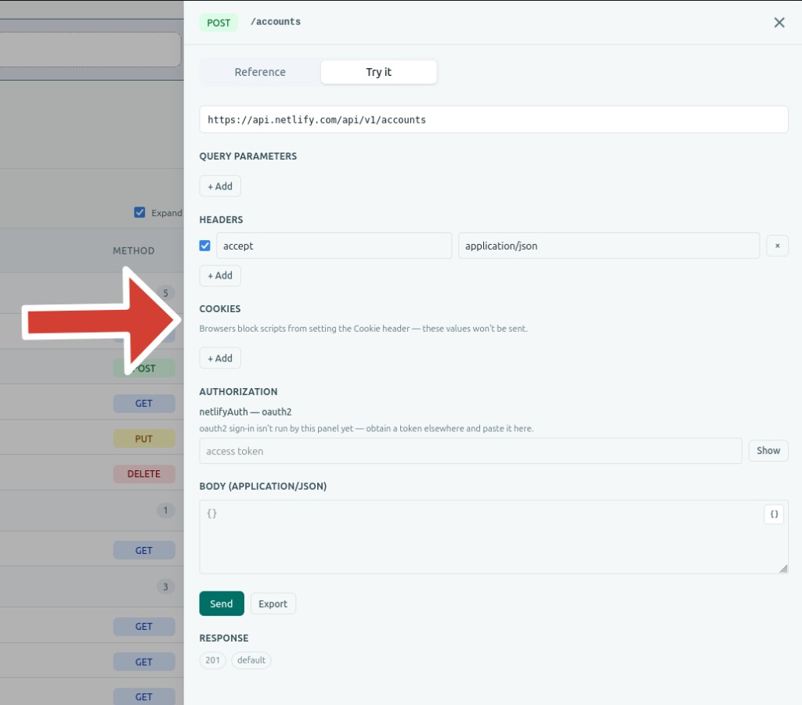
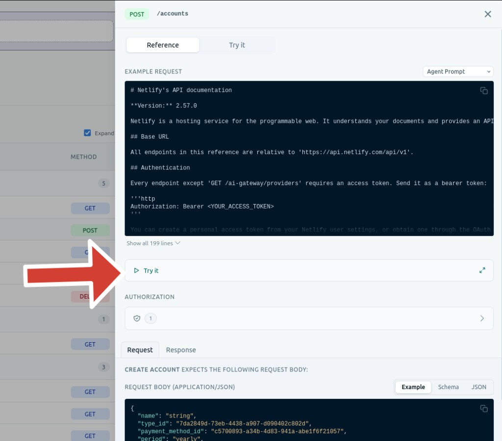
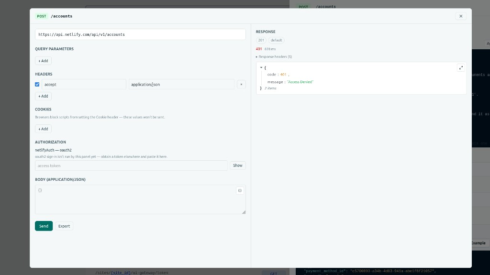

# OpenAPI Try it

[](https://www.npmjs.com/package/@apiuikit/openapi-try-it-plugin)
[](https://www.npmjs.com/package/@apiuikit/openapi-try-it-plugin)
[](./LICENSE)
[](https://apiuikit.com/plugins/openapi-try-it)

A "Try it out" plugin for [apiuikit](https://apiuikit.com). Fill in parameters, auth, and a body, send the request, and inspect the response — from the docs.

This package is not bundled with apiuikit. Install it and pass it as a plugin.

## Install

```sh
npm install @apiuikit/openapi-try-it-plugin
```

Peer dependencies: `apiuikit` ^1.7, React 18+.

## Usage

Two layouts — register either, or both.

Keep the `plugins` array stable by defining it outside the component or with `useMemo`. A new array on every render re-registers the plugins and can reset the selected tab.

You can pass `plugins` to `OpenAPI`, `OpenAPIRenderer`, `OpenAPIProvider`, or a standalone section that receives a `document` prop. When a section is inside a provider, it uses the provider's plugins.

### Tab (default)

Fills the [`openapi.operation.tab`](https://apiuikit.com/docs/plugins#add-a-full-operation-tab) slot — a **Try it** tab next to the built-in Reference tab.



```tsx
import { OpenAPI } from "apiuikit";
import tryItPlugin from "@apiuikit/openapi-try-it-plugin";
import "apiuikit/style.css";
import doc from "./openapi.json";

const plugins = [tryItPlugin];

export default function App() {
  return <OpenAPI openapi={doc} plugins={plugins} />;
}
```

### Button

Fills the [`openapi.operation.reference.supplementary`](https://apiuikit.com/docs/plugins#add-supplementary-inline-content) slot — a **Try it** row on the Path side panel. Clicking it opens a modal with the request on the left and the response on the right.





```tsx
import { OpenAPI } from "apiuikit";
import { createTryItButtonPlugin } from "@apiuikit/openapi-try-it-plugin";
import "apiuikit/style.css";
import doc from "./openapi.json";

const plugins = [createTryItButtonPlugin()];

export default function App() {
  return <OpenAPI openapi={doc} plugins={plugins} />;
}
```

### Both

```tsx
import tryItPlugin, { createTryItButtonPlugin } from "@apiuikit/openapi-try-it-plugin";

const plugins = [tryItPlugin, createTryItButtonPlugin()];
```

## CORS

Requests go from the browser. If the API does not allow your origin, the browser will block them.

This package does not ship a proxy. If you have one, pass it:

```tsx
import { createTryItPlugin } from "@apiuikit/openapi-try-it-plugin";

const plugins = [createTryItPlugin({ proxyUrl: "https://your-proxy.example.com/tryit" })];
```

Requests then go to `${proxyUrl}?target=<url-encoded API URL>` instead of the API origin.

`createTryItButtonPlugin` accepts the same `proxyUrl` option.

## Supported auth

| Scheme | Behavior |
| --- | --- |
| API key (header / query) | Input field |
| HTTP Bearer | Token input |
| HTTP Basic | Username + password |
| OAuth2 client credentials | Fetches a token from the token URL |
| OAuth2 authorization code (+ PKCE) | Login popup, then token exchange |
| Other OAuth2 / OpenID Connect | Paste a token obtained elsewhere |

OAuth2 authorization-code redirect URIs must be same-origin with the page hosting apiuikit.

Cookie API keys cannot be sent from the browser (`Cookie` is a forbidden Fetch header).

## Export

After building a request, export it as a Postman collection, an Insomnia collection, or a HAR file from the **Export** menu.

## Development

```sh
npm install
npm run test
npm run typecheck
npm run build
```

Manual QA against the apiuikit playground: [TESTING.md](./TESTING.md).
